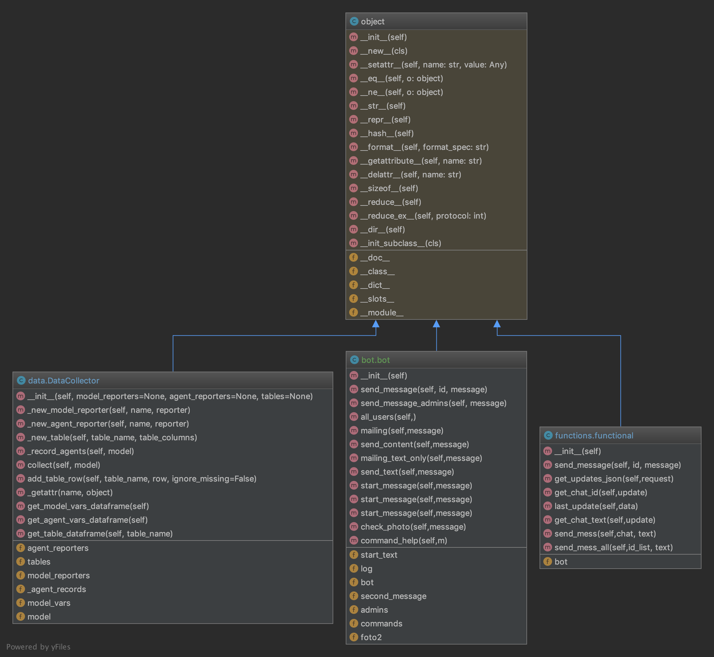

# promoBot
### Feature list:
#### [users]
##### 1. Registrate to crypto course
##### 2. get fresh news
#### [admins]
##### 1.Get all users by url-groups:
###### ling.com/group1 -> will ad to users, comes with this link, which give possibilities to calculate some marketing statistiks like traffic and etc.
##### 2. Send message to all users
##### 3. Send media to all users
##### 4. Get user's statictics 
##### 5. Check user's registrations on promo-site
### Deploy:
#### 1. connect throught ssh to amazon server using private_key file
#### 2. git clone from this repo
#### 3. python3 main.py
#### Bot running!

#### authors:
##### Isaev Vasily       - bot development
##### Lyalyuk Alexandra  - calculate marketing stat's
##### Maslennikova Alina - deployment and documentation

## Class diagram

